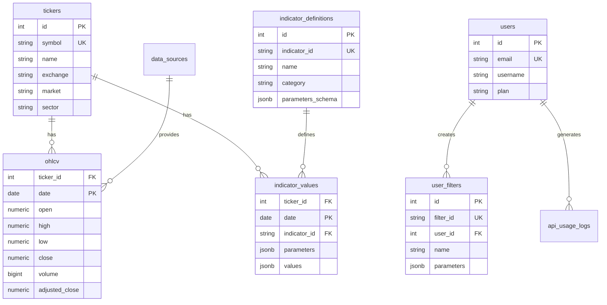

# Data Model (v0.1)

## 개요

본 문서는 TradingView 지표 기반 종목 추천 서비스의 데이터 모델을 정의합니다.

**데이터베이스**: PostgreSQL 14+ with TimescaleDB extension
**ORM**: SQLAlchemy (Python) / Prisma (Node.js)
**Migration Tool**: Alembic (Python) / Prisma Migrate (Node.js)

---

## 데이터베이스 구조

### 데이터베이스 목록

| 데이터베이스 | 용도 | 비고 |
|------------|------|------|
| `stockindicator_prod` | Production 데이터 | Primary + Read Replica |
| `stockindicator_staging` | Staging 환경 | Primary only |
| `stockindicator_dev` | Development 환경 | Local PostgreSQL |

---

## 테이블 목록

| 테이블명 | 설명 | 데이터 크기 추정 | Retention |
|---------|------|----------------|-----------|
| `tickers` | 종목 메타데이터 | ~10K rows | 영구 |
| `ohlcv` | 일별 OHLCV 데이터 | ~50M rows (10년) | 10년 |
| `indicator_definitions` | 지표 메타데이터 | ~100 rows | 영구 |
| `indicator_values` | 계산된 지표 값 | ~150M rows (3년) | 3년 |
| `scan_results` | 스캔 결과 캐시 | ~1M rows | 7일 |
| `backtest_results` | 백테스트 결과 | ~10K rows | 1년 |
| `users` | 사용자 정보 | ~100K rows | 영구 |
| `user_filters` | 사용자 저장 필터 | ~50K rows | 사용자 삭제 시 |
| `api_usage_logs` | API 사용 로그 | ~10M rows/month | 6개월 |
| `data_sources` | 데이터 소스 메타 | ~10 rows | 영구 |

---

## 테이블 상세 설계

### 1. tickers

**설명**: 종목 메타데이터

```sql
CREATE TABLE tickers (
    id SERIAL PRIMARY KEY,
    symbol VARCHAR(20) NOT NULL UNIQUE,
    name VARCHAR(255) NOT NULL,
    exchange VARCHAR(50) NOT NULL,
    market VARCHAR(50) NOT NULL, -- 'US', 'KR', 'JP', etc.
    sector VARCHAR(100),
    industry VARCHAR(100),
    market_cap BIGINT,
    currency VARCHAR(10) DEFAULT 'USD',
    is_active BOOLEAN DEFAULT true,
    first_trade_date DATE,
    last_trade_date DATE,
    created_at TIMESTAMP DEFAULT NOW(),
    updated_at TIMESTAMP DEFAULT NOW()
);

-- Indexes
CREATE INDEX idx_tickers_symbol ON tickers(symbol);
CREATE INDEX idx_tickers_exchange ON tickers(exchange);
CREATE INDEX idx_tickers_market ON tickers(market);
CREATE INDEX idx_tickers_sector ON tickers(sector);
CREATE INDEX idx_tickers_is_active ON tickers(is_active);
```

**예시 데이터**:
```sql
INSERT INTO tickers (symbol, name, exchange, market, sector, market_cap) VALUES
('AAPL', 'Apple Inc.', 'NASDAQ', 'US', 'Technology', 2800000000000),
('TSLA', 'Tesla Inc.', 'NASDAQ', 'US', 'Consumer Cyclical', 780000000000),
('005930', 'Samsung Electronics', 'KRX', 'KR', 'Technology', 350000000000000);
```

---

### 2. ohlcv

**설명**: 일별 OHLCV 데이터 (TimescaleDB hypertable)

```sql
CREATE TABLE ohlcv (
    ticker_id INTEGER NOT NULL REFERENCES tickers(id) ON DELETE CASCADE,
    date DATE NOT NULL,
    open NUMERIC(12, 4) NOT NULL,
    high NUMERIC(12, 4) NOT NULL,
    low NUMERIC(12, 4) NOT NULL,
    close NUMERIC(12, 4) NOT NULL,
    volume BIGINT NOT NULL,
    adjusted_close NUMERIC(12, 4) NOT NULL,
    split_coefficient NUMERIC(8, 6) DEFAULT 1.0,
    dividend NUMERIC(10, 4) DEFAULT 0.0,
    data_source_id INTEGER REFERENCES data_sources(id),
    created_at TIMESTAMP DEFAULT NOW(),
    PRIMARY KEY (ticker_id, date)
);

-- TimescaleDB hypertable 변환
SELECT create_hypertable('ohlcv', 'date', chunk_time_interval => INTERVAL '1 month');

-- Indexes
CREATE INDEX idx_ohlcv_ticker_date ON ohlcv(ticker_id, date DESC);
CREATE INDEX idx_ohlcv_date ON ohlcv(date DESC);
CREATE INDEX idx_ohlcv_volume ON ohlcv(volume);

-- Retention policy (10년)
SELECT add_retention_policy('ohlcv', INTERVAL '10 years');
```

**예시 데이터**:
```sql
INSERT INTO ohlcv (ticker_id, date, open, high, low, close, volume, adjusted_close) VALUES
(1, '2025-11-20', 178.50, 180.20, 177.80, 179.30, 52000000, 179.30),
(1, '2025-11-19', 176.20, 178.90, 175.50, 178.10, 48000000, 178.10);
```

---

### 3. indicator_definitions

**설명**: 지표 메타데이터

```sql
CREATE TABLE indicator_definitions (
    id SERIAL PRIMARY KEY,
    indicator_id VARCHAR(50) NOT NULL UNIQUE, -- 'rsi', 'macd', 'sma', etc.
    name VARCHAR(255) NOT NULL,
    category VARCHAR(50) NOT NULL, -- 'momentum', 'trend', 'volatility', 'volume'
    description TEXT,
    parameters_schema JSONB NOT NULL, -- JSON schema for parameters
    pine_compatible BOOLEAN DEFAULT false,
    created_at TIMESTAMP DEFAULT NOW(),
    updated_at TIMESTAMP DEFAULT NOW()
);

CREATE INDEX idx_indicator_definitions_category ON indicator_definitions(category);
```

**예시 데이터**:
```sql
INSERT INTO indicator_definitions (indicator_id, name, category, description, parameters_schema, pine_compatible) VALUES
('rsi', 'Relative Strength Index', 'momentum', 'Momentum oscillator measuring speed and change of price movements',
 '{"period": {"type": "integer", "default": 14, "min": 2, "max": 100}}', true),
('macd', 'Moving Average Convergence Divergence', 'momentum', 'Trend-following momentum indicator',
 '{"fast_period": {"type": "integer", "default": 12}, "slow_period": {"type": "integer", "default": 26}, "signal_period": {"type": "integer", "default": 9}}', true);
```

---

### 4. indicator_values

**설명**: 계산된 지표 값 (TimescaleDB hypertable)

```sql
CREATE TABLE indicator_values (
    ticker_id INTEGER NOT NULL REFERENCES tickers(id) ON DELETE CASCADE,
    date DATE NOT NULL,
    indicator_id VARCHAR(50) NOT NULL REFERENCES indicator_definitions(indicator_id),
    parameters JSONB NOT NULL, -- e.g., {"period": 14}
    values JSONB NOT NULL, -- e.g., {"rsi": 62.3} or {"macd": 1.23, "signal": 1.15, "histogram": 0.08}
    created_at TIMESTAMP DEFAULT NOW(),
    PRIMARY KEY (ticker_id, date, indicator_id, parameters)
);

-- TimescaleDB hypertable
SELECT create_hypertable('indicator_values', 'date', chunk_time_interval => INTERVAL '1 month');

-- Indexes
CREATE INDEX idx_indicator_values_ticker_indicator_date ON indicator_values(ticker_id, indicator_id, date DESC);
CREATE INDEX idx_indicator_values_date_indicator ON indicator_values(date DESC, indicator_id);

-- Retention policy (3년)
SELECT add_retention_policy('indicator_values', INTERVAL '3 years');
```

**예시 데이터**:
```sql
INSERT INTO indicator_values (ticker_id, date, indicator_id, parameters, values) VALUES
(1, '2025-11-20', 'rsi', '{"period": 14}', '{"rsi": 62.3}'),
(1, '2025-11-20', 'macd', '{"fast_period": 12, "slow_period": 26, "signal_period": 9}', '{"macd": 1.23, "signal": 1.15, "histogram": 0.08}');
```

---

### 5. scan_results

**설명**: 스캔 결과 캐시 (짧은 TTL)

```sql
CREATE TABLE scan_results (
    id SERIAL PRIMARY KEY,
    scan_id VARCHAR(100) NOT NULL UNIQUE,
    date DATE NOT NULL,
    indicator_id VARCHAR(50) NOT NULL,
    parameters JSONB NOT NULL,
    condition JSONB NOT NULL, -- {"operator": "lt", "value": 30}
    universe VARCHAR(50) NOT NULL,
    results JSONB NOT NULL, -- Array of results
    total_matches INTEGER NOT NULL,
    total_scanned INTEGER NOT NULL,
    execution_time_ms INTEGER,
    created_at TIMESTAMP DEFAULT NOW(),
    expires_at TIMESTAMP NOT NULL
);

CREATE INDEX idx_scan_results_scan_id ON scan_results(scan_id);
CREATE INDEX idx_scan_results_date_indicator ON scan_results(date, indicator_id);
CREATE INDEX idx_scan_results_expires_at ON scan_results(expires_at);

-- Cleanup expired results (daily cron job)
-- DELETE FROM scan_results WHERE expires_at < NOW();
```

---

### 6. backtest_results

**설명**: 백테스트 결과

```sql
CREATE TABLE backtest_results (
    id SERIAL PRIMARY KEY,
    indicator_id VARCHAR(50) NOT NULL,
    parameters JSONB NOT NULL,
    condition JSONB NOT NULL,
    universe VARCHAR(50) NOT NULL,
    period VARCHAR(10) NOT NULL, -- '1d', '1w', '1m', '1y', etc.
    start_date DATE NOT NULL,
    end_date DATE NOT NULL,
    metrics JSONB NOT NULL, -- {"win_rate": 0.623, "sharpe_ratio": 1.42, etc.}
    equity_curve JSONB, -- [{"date": "2024-01-01", "value": 10000}, ...]
    created_at TIMESTAMP DEFAULT NOW(),
    UNIQUE(indicator_id, parameters, condition, universe, period, start_date, end_date)
);

CREATE INDEX idx_backtest_results_indicator ON backtest_results(indicator_id);
CREATE INDEX idx_backtest_results_period ON backtest_results(period);
CREATE INDEX idx_backtest_results_created_at ON backtest_results(created_at DESC);
```

---

### 7. users

**설명**: 사용자 정보

```sql
CREATE TABLE users (
    id SERIAL PRIMARY KEY,
    email VARCHAR(255) NOT NULL UNIQUE,
    username VARCHAR(100) UNIQUE,
    password_hash VARCHAR(255), -- For local auth
    oauth_provider VARCHAR(50), -- 'google', 'github', etc.
    oauth_id VARCHAR(255),
    plan VARCHAR(50) DEFAULT 'free', -- 'free', 'premium'
    is_active BOOLEAN DEFAULT true,
    last_login_at TIMESTAMP,
    created_at TIMESTAMP DEFAULT NOW(),
    updated_at TIMESTAMP DEFAULT NOW()
);

CREATE INDEX idx_users_email ON users(email);
CREATE INDEX idx_users_oauth_provider_id ON users(oauth_provider, oauth_id);
```

---

### 8. user_filters

**설명**: 사용자 저장 필터

```sql
CREATE TABLE user_filters (
    id SERIAL PRIMARY KEY,
    filter_id VARCHAR(100) NOT NULL UNIQUE,
    user_id INTEGER NOT NULL REFERENCES users(id) ON DELETE CASCADE,
    name VARCHAR(255) NOT NULL,
    description TEXT,
    indicator_id VARCHAR(50) NOT NULL,
    parameters JSONB NOT NULL,
    condition JSONB NOT NULL,
    universe VARCHAR(50) NOT NULL,
    is_public BOOLEAN DEFAULT false,
    view_count INTEGER DEFAULT 0,
    created_at TIMESTAMP DEFAULT NOW(),
    updated_at TIMESTAMP DEFAULT NOW()
);

CREATE INDEX idx_user_filters_user_id ON user_filters(user_id);
CREATE INDEX idx_user_filters_filter_id ON user_filters(filter_id);
CREATE INDEX idx_user_filters_is_public ON user_filters(is_public);
```

---

### 9. api_usage_logs

**설명**: API 사용 로그 (TimescaleDB hypertable)

```sql
CREATE TABLE api_usage_logs (
    id BIGSERIAL,
    timestamp TIMESTAMP NOT NULL DEFAULT NOW(),
    user_id INTEGER REFERENCES users(id),
    endpoint VARCHAR(255) NOT NULL,
    method VARCHAR(10) NOT NULL,
    status_code INTEGER NOT NULL,
    response_time_ms INTEGER,
    ip_address INET,
    user_agent TEXT,
    request_body JSONB,
    PRIMARY KEY (id, timestamp)
);

-- TimescaleDB hypertable
SELECT create_hypertable('api_usage_logs', 'timestamp', chunk_time_interval => INTERVAL '1 week');

CREATE INDEX idx_api_usage_logs_user_id ON api_usage_logs(user_id, timestamp DESC);
CREATE INDEX idx_api_usage_logs_endpoint ON api_usage_logs(endpoint, timestamp DESC);

-- Retention policy (6개월)
SELECT add_retention_policy('api_usage_logs', INTERVAL '6 months');
```

---

### 10. data_sources

**설명**: 데이터 소스 메타데이터

```sql
CREATE TABLE data_sources (
    id SERIAL PRIMARY KEY,
    source_name VARCHAR(100) NOT NULL UNIQUE, -- 'yfinance', 'polygon', 'tiingo'
    source_type VARCHAR(50) NOT NULL, -- 'free', 'paid'
    license VARCHAR(50), -- 'MIT', 'commercial', etc.
    api_url VARCHAR(500),
    is_active BOOLEAN DEFAULT true,
    last_sync_at TIMESTAMP,
    created_at TIMESTAMP DEFAULT NOW()
);

INSERT INTO data_sources (source_name, source_type, license, api_url) VALUES
('yfinance', 'free', 'Apache-2.0', 'https://query1.finance.yahoo.com/'),
('polygon', 'paid', 'commercial', 'https://api.polygon.io/'),
('tiingo', 'paid', 'commercial', 'https://api.tiingo.com/');
```

---

## ERD (Entity Relationship Diagram)



---

## 인덱스 전략

### 읽기 최적화 인덱스
- `ohlcv`: (ticker_id, date DESC) - 종목별 최신 데이터 조회
- `indicator_values`: (ticker_id, indicator_id, date DESC) - 지표 시계열 조회
- `scan_results`: (date, indicator_id) - 스캔 결과 캐시 조회

### 복합 인덱스 고려사항
- `ohlcv(ticker_id, date)`: Range scan 최적화
- `indicator_values(date, indicator_id)`: 전체 종목 스캔 최적화
- Partial Index: `WHERE is_active = true` (tickers)

---

## 데이터 보관 정책 (Retention Policy)

| 테이블 | 보관 기간 | 정책 |
|--------|----------|------|
| `ohlcv` | 10년 | TimescaleDB retention policy |
| `indicator_values` | 3년 | TimescaleDB retention policy |
| `scan_results` | 7일 | Daily cron job cleanup |
| `api_usage_logs` | 6개월 | TimescaleDB retention policy |
| `backtest_results` | 1년 | Manual cleanup or cron |

---

## 백업 및 복구

### 백업 전략
- **Continuous Archiving**: WAL (Write-Ahead Logging) 기반 Point-in-Time Recovery (PITR)
- **Daily Snapshot**: 매일 자정 전체 DB 백업 (S3/GCS에 저장)
- **Retention**: 일일 백업 30일 보관, 주간 백업 3개월 보관

### 복구 시나리오
1. **단순 데이터 손상**: 최신 백업에서 복구
2. **특정 시점 복구**: WAL 로그 기반 PITR
3. **재해 복구**: Read Replica 승격 또는 최신 백업 복구

---

## 성능 최적화

### 파티셔닝
- `ohlcv`: 날짜 기준 월별 파티션 (TimescaleDB 자동 처리)
- `indicator_values`: 날짜 기준 월별 파티션
- `api_usage_logs`: 날짜 기준 주별 파티션

### 캐싱 전략
- **Redis**: 스캔 결과 (TTL 1시간), 지표 목록 (TTL 24시간)
- **Application-level**: 지표 정의, 종목 메타데이터

### 쿼리 최적화
- Prepared Statements 사용
- Batch Insert (ETL 파이프라인)
- Connection Pooling (pgBouncer)

---

## 마이그레이션 관리

### 도구
- Python: Alembic
- Node.js: Prisma Migrate

### 마이그레이션 네이밍 규칙
```
YYYYMMDD_HHMMSS_short_description.sql
```

예:
```
20251121_100000_create_tickers_table.sql
20251121_110000_add_index_to_ohlcv.sql
```

### 롤백 전략
- 각 마이그레이션에 `up` 및 `down` 스크립트 포함
- Production 배포 전 Staging 환경에서 테스트

---

## 변경 이력

| 버전 | 날짜 | 변경 내용 | 작성자 |
|------|------|----------|--------|
| 0.1  | 2025-11-21 | 초안 작성 | Data Team |

---

**다음 단계**: 실제 DDL 스크립트 작성 및 마이그레이션 파일 생성 (`migrations/` 디렉토리)
